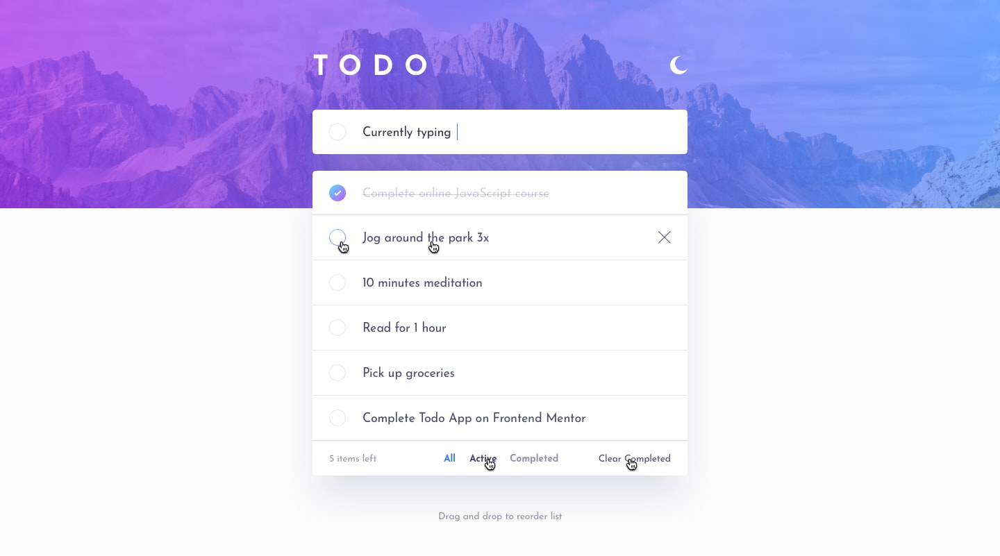

`#react.js` `#master-in-software-engineering`

<!-- ALL-CONTRIBUTORS-BADGE:START - Do not remove or modify this section -->

[](#contributors-)

<!-- ALL-CONTRIBUTORS-BADGE:END -->

# Assembler School: React.js Wish List <!-- omit in toc -->

In this project you will learn how to create a React.js Wish list.

## Table of Contents <!-- omit in toc -->

- [Getting Started](#getting-started)
- [The Project](#the-project)
- [Project requirements](#project-requirements)
- [Project delivery](#project-delivery)
- [Resources](#resources)

## Getting Started

This is a wishlist feature for an e-commerce app built with React that allows users to save products they are interested in purchasing for future reference. The wishlist feature is built using `useState`, `useEffect`, `useContext`, `input events`or any other hooks you feel ready to use in order to create a seamless user experience.

## Contents and Branches Naming Strategy <!-- omit in toc -->

The repository is made up of several branches that include the contents of each
section.

The branches follow a naming strategy like the following:

- `main`: includes a basic repository using react with `create-react-app`
- `assembler-solution`: includes a proposed solution

### Fetching All the Branches

In order to fetch all the remote branches in the repository, you can use the
following command:

```sh
$ git fetch --all
```

or

```sh
$ git branch -r
```

### List Both Remote Tracking Branches and Local Branches

```sh
$ git branch --all
```

If you decide to use this repository, which is not mandatory, you can create a local branch based on a remote branch with the following
command:

```sh
$ git checkout -b <new_branch_name> <remote_branch_name>
```

### Installing

First, you will need to install the dependencies with: `npm install`.

Run the following command in your terminal after cloning the main repo:

```sh
$ npm install
```

### Git `precommit` and `prepush` Hooks

In the `assembler-solution` branch you can see an implementation of these tools
if you'd like to use them.

## Deployment <!-- omit in toc -->

In this pill we won't deploy the app.

## Technologies used <!-- omit in toc -->

- `React.js`
- `@testing-library/react`
- `eslint`
- `prettier`
- `lint-staged`
- `husky`

## The Project

This is a wishlist feature for an e-commerce app built with React that allows users to save products they are interested in purchasing for future reference. The wishlist feature is built using useState, useEffect, useContext and input events to create a seamless user experience.



## Project requirements

This is an overview of the main requirements of this project.

- You should always try to solve them by yourself before asking for help
- You should always help your team members and fellow squad members of the master so
  that you can all learn together and become better software developers and team
  members
- You must finish all the steps that are marked as `Required`
- **You must use semantic HTML5 elements for all the markup of the application**
- Once you are done, you can move on to the optional ones that are marked as
  `Extra 💯`

### 1. Styles and Layout

For this step you have to think of the layout for the app and implement some sketches using platforms such as Figma or a similar app.

1. For the styles you can use any library or native languages such as `CSS`, `SCSS` or `Styled Components`.
2. The layout must be responsive so that it works in all device sizes

### 2. Show All the Wishes

In this step you must implement the logic to render all the wishlist items of the app.
This means that all the wishlist items are rendered without taking into account if they
are completed or not.

1. **A wishlist must be created and its state passed as props or context to the required
   page components**
2. **All the methods that modify the state must also be passed as props or context**
3. If there are no wished items created you must render a message telling the user that
   they can create their first wish to get started
4. You can also render an illustration that indicates users how they can create
   a wish to get started. (You can use illustrations on your own or use one from the internet, this is a great resource: [undraw.co](https://undraw.co/illustrations) ).

### 3. Creating Wishes

#### Step 1

Users should be able to add products to their wishlist by clicking a "Add to Wishlist" button on a product page. The product information should be stored in the app's state using useState.

1.  If the user presses enter without entering a value in the wish form, an
    error message should be rendered.
3.  Users must be able to press the `enter` key on their keyboard to create the
    wish (if you implement it using semantic html5 this comes for free)

#### Step 2

Users should be able to view their wishlist by clicking a "View Wishlist" button on the app's main navigation. The wishlist should be displayed as a separate component that shows all the products the user has added to their wishlist. This feature could use useContext to access the app's state.

1. By default the list should be empty.
2. The list must be implemented using `ul` and `li` elements.
3. To test the wish creation requirement you will need to:
   1. the `li` list element should have a `checkbox` value set to `checked` or not depending on if the wish was marked as completed.

#### Step 3

Render the total number of wishes in the app footer.

1. At the above image, we are providing a general guidence towards what you could include here and how to separate the items.

### 4. Editing Wishes

Users should be able to edit the quantity of a product in their wishlist. This can be done using input events and updating the app's state with `useState`.

1. Clicking the wish name should open a form that allows users to edit the wish
   name.
   1. This can be implemented either in line or by filling out the new wish form
      with the details of the wish that was clicked
   2. We recommend that you implement a solution that allows users to edit the
      wish in line. This means that clicking the wish name replaces the wish
      with a form that has a value of the wish's name
   4. Then, by clicking on the done button or by pressing enter, the wish is
      edited and saved
2. Users should be able to delete wishes by clicking the `X` button that is
   rendered when users hover over the wish name. The removed wish should be removed from the app's state using useState.
3. Users must be able to mark a wish as completed when they press the `Done`
   button that is rendered when the user hovers over the wish name

### 5. Filtering wishes

In this step you will create a page for each wish type.

In order to allow users to navigate to a page you will need to complete the
footer of the app that you can see in the screenshot above.

You will have to render the following in the footer:

1. The total count of all the `active` wishes
2. A link to the home page that renders `all` the wishes, **both active and
   completed**
3. A link to the active wishes page that renders the `active` wishes
4. A link to the completed wishes page that renders the `completed` wishes

#### 5.1 All wishes

- Route: `/`
- Page Component: `Home`

In this page you will render all the wishes, both completed or not.

#### 5.2 Completed wishes

- Route: `/completed`
- Page Component: `Completed`

In this page you will render all the **completed** wishes.

You will need to think of a way to store or filter the wishes that are completed.

A possible solution is to use `[].filter` or to store the wishes in a different
`this.state` property.

Feel free to think of a solution for this requirement.

#### 5.3 Active wishes

- Route: `/active`
- Page Component: `Active`

In this page you will render all the **active** wishes, that is, all the wishes
that are not completed.

You will need to think of a way to store or filter the wishes that are active.

A possible solution is to use `[].filter` or to store the wishes in a different
`this.state` property.

Feel free to think of a solution for this requirement.

#### 6. Persist wishlist data

The app should persist the user's wishlist data between sessions. This feature can be implemented using `localStorage`, `sessionStorage` or `cookies` so that users can refresh the app and their previous wishes are not lost. You can also add them directly from the database. 

You must store the wishes in a single local storage entry named:
`"wish-list"`.

The wishes should be stored using the following shape (you can add other
properties but these are required):

- `id`: the id of the wish
- `text`: the text content of the wish
- `done`: boolean that indicates wether the wish is completed or not
- `isEditing`: boolean that indicates wether the wish is currently being edited

```js
[
  {
    id: "9c34e805-7bfc-401a-b386-468c25315e46",
    text: "wish 01",
    done: false,
    isEditing: false,
  },
  {
    id: "d733a37e-cc4e-4cde-916f-935b3e915bb3",
    text: "wish 02",
    done: false,
    isEditing: false,
  },
];
```

### 💯 Extras

#### 1. Embed the project to your e-commerce project.

#### 2. Add notes to product in wishlist

Users should be able to add notes to a product in their wishlist. This feature can be implemented using input events and updating the app's state with useState.

#### 3. Sort and filter wishlist
Users should be able to sort and filter their wishlist by product name, price, or other criteria. This feature can be implemented using useEffect to update the app's state based on user input.

#### 4. Clear all the Completed wishes

Users must be able to clear all the wishes that are completed. You can implement
a button in the app footer that allows users to clear the completed wishes.

#### 5: Light & Dark Mode Switch

#### 6. Share wishlist
Users should be able to share their wishlist with friends or family via email or social media. This feature can be implemented using a third-party API or library.


## Conclusion

The wishlist feature is an important component of any e-commerce app that allows users to save products for future purchase. By using useState, useEffect, useContext and input events, we can create a wishlist that provides a seamless user experience. The must-have features ensure that the basic functionality of the wishlist is in place, while the should-have features provide additional functionality that can enhance the user's experience.

## Project delivery

To deliver this project you must send us the link to your repository or branch within your classroom card. 

## License <!-- omit in toc -->

This project is licensed under the MIT License - see the [LICENSE](LICENSE) file
for details

## Contributors ✨ <!-- omit in toc -->

This project follows the
[all-contributors](https://github.com/all-contributors/all-contributors)
specification. Contributions of any kind welcome!
