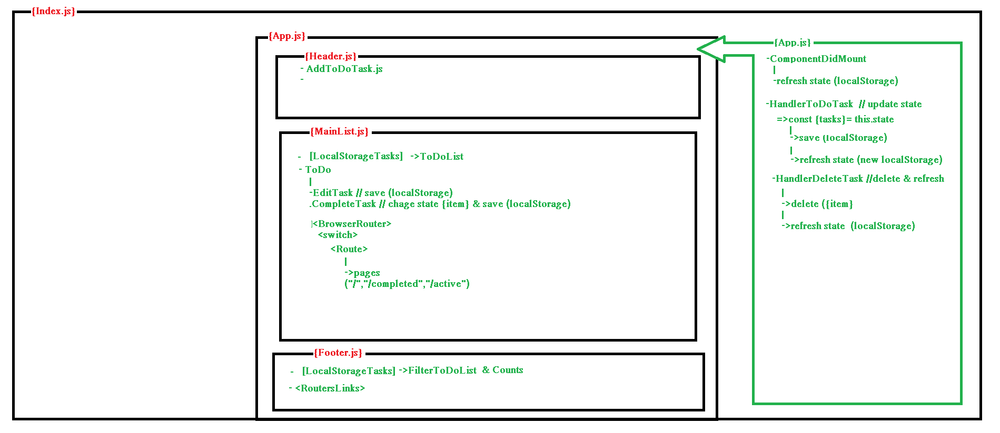

# React To Do List 
Basic to do list with friendly UI, using react, local storage 
and bootstrap.

## Appendix

Any additional information goes here

- [Documentation](#documentation)
- [Lessons Learned](#lessons-learned)
- [Resources](#resources)
- [Links](#links)  
## Documentation

-[Original repo]( https://github.com/assembler-school/reactjs-todo-list )

  
## Lessons Learned

- Use React
    -to use props and states
    -to organice and structure components 😭   

- To work in peer coding

- Use SASS with React

- To design friendly UI with bootstrap

  
## Resources

- [WEBPACK](https://webpack.js.org/concepts/)
- [SASS](https://sass-lang.com/guide)
- [REACT](https://es.reactjs.org/)
- [BOOTSTRAP](https://getbootstrap.com/docs/4.6)

## Authors

- [@CHerreroTinoco](https://github.com/Cherrerotinoco)
- [@ParisArcos](https://github.com/ParisArcos)

  
## 🔗 Links
Paris Arcos
Christian Herrero

## Screenshots

  
